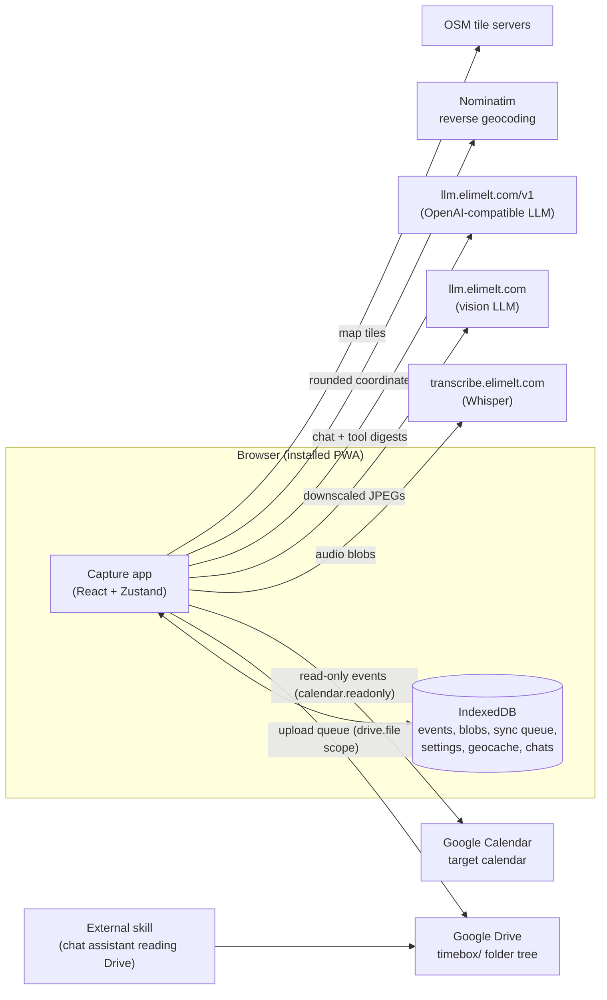

# Capture — Architecture

Capture is a mobile-first Progressive Web App (TypeScript/React) for capturing what
you did and when, with voice as the primary input. Its product principles shape every
technical decision: **offline-first** (capture never needs a network or a token),
**append-only** (nothing is ever edited or deleted in place — every change is a new
event), **voice-first capture** (record now, interpret later; no AI runs at capture
time), **Google Drive as the sync substrate** (there is no Capture backend — the
user's own Drive holds the replicated log, and external chat-assistant "skills" read
the same files), and **opt-in AI** (transcription, captioning, and a chat assistant
are best-effort enrichments that degrade to no-ops when offline or disabled).

## System context

All persistent state lives in IndexedDB and the user's Drive. The external endpoints
are stateless from the app's perspective; every result lands back in the local log or
a local cache.

## Layered architecture

Directories under `src/` map onto layers with a strict one-way dependency direction:

| Layer | Directories | Role |
| --- | --- | --- |
| Contract | `contract/` | Event schema, fold, filenames, wire format — the shared language with Drive-reading skills. Depends on nothing else in `src/`. |
| Streams | `streams/` | Registry of capture profiles (v1 ships only `timelog`). Imports only contract types. |
| Store | `store/` | IndexedDB repositories (events, places, settings) and the single Zustand `appStore`. |
| Drive | `drive/` | GIS auth, Drive client, tree bootstrap, upload queue. Imports contract + store repos. |
| Pipelines & enrichment | `transcribe/`, `vision/`, `enrich/`, `places/` | Post-capture enrichment writing back via ordinary `amend` events; `enrich/` is the shared drain engine + failure taxonomy both media pipelines bind onto. |
| Notifications | `notify/` | Capability detection, app-icon badging, best-effort local notifications; Web Push plumbing awaiting a server (there is no backend to send push today). |
| Calendar read-back | `gcal/` | Read-only Google Calendar client + target-calendar selection for the timelog Day view. Timelog-specific (not a generic layer); imports contract, drive, store, streams. |
| Screens & shell | `capture/`, `dayview/`, `context/`, `settings/`, `assistant/`, `ui/`, `App.tsx`, `main.tsx` | Routing, design system, and the app screens. |

The layering rule (SPEC §10) declares the generic layers — `streams/`, `capture/`,
`contract/`, `store/`, `places/`, `drive/`, `transcribe/`, `vision/`, `enrich/`,
`notify/`, `ui/` —
**stream-agnostic**: they must not import from the timelog-specific or app-level
directories `gcal/`, `dayview/`, `settings/`, or `assistant/`. This is enforced
mechanically by [`src/layering.test.ts`](../src/layering.test.ts), which loads every
source file in the generic layers via `import.meta.glob(?raw)`, extracts static
import specifiers, resolves relative paths to their top-level `src/` directory, and
fails the test suite on any hit in a forbidden directory. The payoff is that the generic capture client is
separable by construction — a second stream or a fork without the timelog UI touches
none of the generic modules.

## Core design decision: append-only event log + fold

Every stream is an immutable log of `capture.event.v1` events with exactly three
types: `capture` creates an entry, `amend` patches prior captures, `revoke` hides
them. "Edit" and "delete" are new events referencing earlier ids; nothing is ever
mutated in place. Read state is always derived: `fold(events)`
(`src/contract/fold.ts`) sorts by `seq` → `loggedAt` → `id` (`compareEvents`),
applies amends, drops revoked entries, and returns the visible `Entry[]`. The fold
is deterministic and insensitive to arrival order.

Why, and what follows from it:

- **Idempotency.** Filenames (`<seq6>_<timestamp>_<id>`) are computed once at append
  time and key both the local blob and the Drive file; the upload queue
  finds-before-uploads, so retries never duplicate anything.
- **Crash safety.** A local append is one IndexedDB transaction (seq counter + event
  + blobs + sync row) — all or nothing. In Drive, "the `.json` record exists" *is*
  the commit; attachments upload first, so an interruption leaves only invisible
  orphans.
- **Multi-device story.** The event `id` is the identity; seq is a per-device
  ordering hint, so two devices appending offline can mint the same seq — ties are
  broken deterministically by `loggedAt` then `id`, and every replica folds to
  identical state. Each sync cycle pulls remote events (discovered by id from Drive
  filenames alone) before pushing local ones; a name-sorted Drive listing *is* log
  order.
- **Skills and external readers.** The byte-stable wire format and filename scheme
  mean a skill needs only a Drive listing and the same fold — no index, no API, no
  server. The app and skills compute identical state from identical files.
- **UX consequences.** Undo-able delete is just a delayed `revoke`; user edits of
  machine transcripts can never be clobbered because derivation history is permanent.

## Subsystems

### Data model & sync — [docs/subsystems/data-and-sync.md](subsystems/data-and-sync.md)

`contract` + `streams` + `store` + `drive`: the generic, offline-first capture
engine. A UI action becomes an atomic IndexedDB append; each user-initiated sync
cycle (sync is manual-only, via Settings' "Sync now") first pulls
events other devices committed to Drive (id-based discovery from filenames, eager
attachment download, atomic import), then the upload queue drains pending rows in
seq order to the `timebox/` tree in Drive (bootstrap is idempotent and
self-healing) — the local log is a replica of the Drive log. Reads never consult
Drive — the entry list is always a fresh fold over the local log. Auth is
gesture-driven GIS tokens (~1 hour, `drive.file` + read-only Calendar scopes in one
consent, no refresh tokens, no backend); expiry surfaces as a passive reconnect pill and
never blocks capture. Failures are classified (auth → reconnect, retryable → row
stays queued and the next manual sync retries it, else → error toast). Module docs:
[contract-and-streams](modules/contract-and-streams.md),
[store](modules/store.md), [drive](modules/drive.md).

### AI & enrichment — [docs/subsystems/ai-and-enrichment.md](subsystems/ai-and-enrichment.md)

Post-capture, on-device-initiated, best-effort machine understanding. The two media
pipelines (`transcribe`, `vision`) share a plan/api/runner pattern: a pure `plan.ts`
over the raw event history decides what still needs work (the `derivedFrom` field on
attachments is the machine/user boundary — once derived, a source is permanently
"done", so user edits are never regenerated over); a single `api.ts` function calls
the external service and throws a classified `EnrichmentError` on failure
(`enrich/error.ts`); a `runner.ts` binds the plan/api/live-text-store onto
`enrich/runner.ts`'s shared drain engine, which appends the result as an ordinary
`amend` (the normal queue syncs it — zero pipeline-specific sync code), backs off
transient failures, skip-marks permanent ones, defers a missing source blob instead of
abandoning it, and trips a per-drain circuit breaker against a stalled host. `places`
does synchronous
point-in-radius matching at capture time and throttled, cached Nominatim reverse
geocoding that never throws. The chat assistant is an opt-in, lazy-loaded,
client-side agent loop over the local log: read tools plus two narrow write tools
(create/update entry) that append ordinary capture/amend events through the store's
single write path — never revoke, settings, or sync; nothing is stored server-side.
Module docs:
[pipelines-and-places](modules/pipelines-and-places.md),
[assistant](modules/assistant.md).

### Application shell & UI — [docs/subsystems/app-and-ui.md](subsystems/app-and-ui.md)

Boot is a three-stage handoff (HTML splash → service-worker registration and
persistent-storage request in `main.tsx` → store `init()` in `App.tsx`) so first
paint is real content. The Capture, Day view, Chat, and Settings screens hang off one
flat route table and a bottom tab bar; drill-downs are modal sheets, not routes.
The Day view overlays read-only Google Calendar events from a user-chosen target
calendar via `src/gcal` (single Google token, `calendar.readonly` scope; the app
never writes events). `App.tsx` owns app-level lifecycle: re-reading local state on
`visibilitychange` (Drive sync is manual-only, via Settings' "Sync now"),
re-running enrichment whenever entries change, and the notification hooks
(`src/notify`): the Home Screen badge tracks the pending-sync count and a
best-effort local notification announces enrichment finishing while the app is
hidden — there is no backend, so no remote push. The
design system lives entirely in `src/ui` (tokens + primitives; screens never hardcode
palette or shape classes), and a set of iOS-specific invariants (keyboard insets,
body scroll lock, safe areas, 44 pt tap targets, pending-delete undo) are
load-bearing. Module docs:
[app-shell-ui-and-tooling](modules/app-shell-ui-and-tooling.md),
[capture-and-dayview](modules/capture-and-dayview.md),
[gcal](modules/gcal.md), [assistant](modules/assistant.md),
[notify](modules/notify.md).

## Cross-cutting concerns

**Error handling.** Store write actions are wrapped in `guard(label, fn)`: failures
set `lastError` ("label: message") — rendered as the single global toast — and
re-throw for awaiting callers. `drainSync` is deliberately unguarded (its sole
caller, Settings' "Sync now" button, renders the returned outcome) and reports via
`lastError` without throwing. Drive calls throw a typed
`DriveError` classified into reconnect / retry-later / error outcomes; enrichment
runners never surface errors at all (backoff or persistent skip markers).

**Offline behavior.** Capture, day view, and settings work fully offline; entries
land in IndexedDB and the sync queue, and the next manual "Sync now" in Settings
runs the full pull-then-push cycle (a Settings status line shows "Out of sync" /
last-synced state so nothing waits invisibly). Enrichment drains return immediately when
`!navigator.onLine`. The service worker precaches the app shell and runtime-caches
OSM tiles and Nominatim responses, so maps work offline too. Offline is not an error
state anywhere in the system.

**Privacy posture.** There is no Capture server. Data leaves the device only as:
the replicated log to the user's own Drive (`drive.file` scope — the app sees only
files it created); audio blobs to the transcription endpoint and downscaled JPEGs to
the captioning endpoint (automatic once entries exist, one attachment per request);
chat messages plus text digests to the LLM endpoint (only after the user sends a
message, never raw media); and rounded coordinates to Nominatim. No API keys are
involved, and the CSP in `index.html` whitelists exactly these endpoints.

**Testing strategy.** Unit tests are colocated next to their sources
(`*.test.ts` throughout `src/`), run with Vitest via `npm test`. The one
network-dependent test (`src/assistant/transport.integration.test.ts`) is excluded
unless `VITEST_INTEGRATION=1` (`npm run test:integration`), so the default suite is
hermetic. `src/layering.test.ts` turns the architecture's dependency rules into a
failing test. CI runs `npm test` before every deploy.

## Build & deploy

Vite builds the app; `vite-plugin-pwa` generates an auto-updating Workbox service
worker that precaches the build output except the lazy assistant chunk (cached
`CacheFirst` at runtime for opted-in users only) and defines the runtime caches for
fonts, OSM tiles, and Nominatim. The `CI` workflow
(`.github/workflows/ci.yml`) runs on pull requests and pushes to `main`:
`npm ci`, `npm test`, `npx tsc -b`, `npm run lint`, `npm run build`.
Deployment is GitHub Pages via
`.github/workflows/deploy.yml`: on push to `main`, CI runs `npm ci`, `npm test`,
`npm run build`, copies `dist/index.html` to `404.html` (SPA fallback for deep
links), and publishes the artifact with `deploy-pages`.

## Where to start reading

1. **This document** for the system shape, then **`SPEC.md`** for product intent and
   the Drive contract (source code wins where they disagree).
2. **[data-and-sync](subsystems/data-and-sync.md)** — the event log, fold, and queue
   are the heart of the system; everything else is layered on them. Start with
   `src/contract/types.ts` and `src/contract/fold.ts` in code.
3. **[app-and-ui](subsystems/app-and-ui.md)** — boot, routing, state flow, and the
   UI invariants you must preserve when adding screens.
4. **[ai-and-enrichment](subsystems/ai-and-enrichment.md)** — the pipeline pattern
   and privacy posture, if you touch transcription, captioning, places, or the
   assistant.
5. **Module docs** in [docs/modules/](modules/) for file-level detail, and
   `src/layering.test.ts` for the dependency rules you are not allowed to break.
