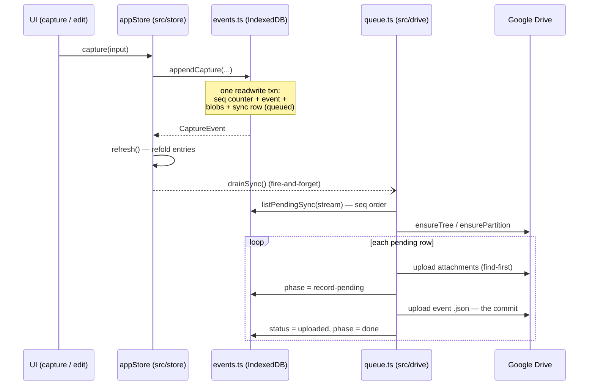

# Subsystem: Data model & sync

**Modules:** `src/contract` + `src/streams` + `src/store` + `src/drive`
(SPEC §3, §5, §8). This document covers cross-module design and flows; for
file-level detail see the module docs:

- [contract-and-streams.md](../modules/contract-and-streams.md) — event types, wire
  format, filenames, fold, stream registry
- [store.md](../modules/store.md) — IndexedDB repositories and the Zustand app store
- [drive.md](../modules/drive.md) — GIS auth, Drive client, bootstrap, upload queue

Together these four modules implement the core of the app: a **generic,
offline-first, append-only event log** that is captured locally, replicated to the
user's Google Drive, and consumed both by the app's own UI (via the fold) and by
external chat-assistant skills that read the same files from Drive.

## 1. The append-only event log

Every stream (a named capture profile from `src/streams/registry.ts`; v1 ships only
`timelog`) is backed by an immutable log of events with schema `capture.event.v1`
(`src/contract/types.ts`). This is the system's foundational invariant (SPEC §3.2):

- **Three event types.** `capture` creates an entry; `amend` patches one or more
  prior captures (timestamp, location, attachment add/remove); `revoke` hides them.
  Nothing is ever edited or deleted in place — "edit" and "delete" are *new events*
  referencing earlier ids. Removed attachments and cleared locations remain in the
  log forever; they are only hidden from the folded view.
- **The fold is the read model.** `fold(events)` (`src/contract/fold.ts`) sorts by
  `seq`, applies amends to their targets (amends after a revoke are silently
  ignored; unknown targets are skipped), drops revoked entries, and returns
  `Entry[]` ordered by effective `capturedAt`. The fold is deterministic and
  order-insensitive to arrival order, so the app and Drive-reading skills compute
  identical state from the same events.
- **Seq allocation is local and per-stream.** `src/store/events.ts` allocates
  `seq` from the IndexedDB `meta` counter `nextSeq:<stream>` inside the same
  transaction that writes the event, so seqs are monotonic and gap-free per device.
  Event ids are 6-char random base36 (`ids.ts`), unique-enough per stream.
- **Filenames are the ordering.** Log files are named
  `<seq6>_<timestamp>_<id>[suffix].ext` (`filenames.ts`), partitioned by local date
  of `loggedAt`. A name-sorted Drive listing *is* log order, and `seqOfFilename`
  recovers `seq` from names alone — a skill needs no index, just a listing.
- **Byte-stable wire format.** `serializeEvent` produces deterministic JSON (fixed
  key order, 2-space indent, trailing newline, optional fields omitted), so the
  bytes in Drive are reproducible and diff-friendly; `parseEvent` validates the
  envelope on the way back in.

The non-event contract files (`streams.json`, `config.json`, `checkpoint.json`,
`src/contract/files.ts`) round out the Drive contract. `config.json` and
`checkpoint.json` are **skill-owned**: the app writes them only as create-if-absent
stubs (see §5 on why) and never overwrites a skill's edits.

## 2. Write path: UI action → IndexedDB → upload queue → Drive

A capture (or amend/revoke) flows through four stages, each owned by one module:



Stage by stage:

1. **UI → store.** The Zustand app store (`src/store/appStore.ts`) is the single
   entry point: `capture`/`amend`/`revoke` actions delegate to the event repo, then
   `refresh()` to refold. Capture never needs a token or network — offline capture
   is the design center (SPEC §2).
2. **Atomic local append.** `events.ts#append()` commits the seq-counter increment,
   the event row, every attachment blob (keyed by its contract filename), and a
   `sync` row in **one IndexedDB transaction**. No partial appends can exist. The
   sync row starts `queued` with `phase: 'attachments-pending'` (or
   `'record-pending'` when there are no attachments).
3. **Queue drain.** `drainSync` fires on capture, app init, explicit connect, and
   manual sync. With a valid token it calls `drainStream(token, stream)`
   (`src/drive/queue.ts`), which processes pending rows **in seq order** so the
   Drive log commits monotonically.
4. **Drive tree + commit.** On first use (or a cache miss) the drainer runs
   `ensureTree` (`bootstrap.ts`): `timebox/` root, `streams.json`, and per stream a
   folder with `config.json`/`checkpoint.json` stubs, `log/`, and `results/` —
   every step finds-before-creates, with ids cached in `tree.ts`. Then, per event:
   attachments upload first, the event record `.json` last. **The record is the
   commit** (SPEC §5.2): an event exists in Drive iff its record does. Orphan
   attachments from an interrupted upload reference nothing and are invisible to
   any fold.

After a successful upload, local audio blobs are pruned unless the stream's
`keepAudioLocally` setting says otherwise.

## 3. Read path: fold → entries → UI

Reads never consult Drive. The UI's entry list is always a fresh fold over the
local log: `listEntries(stream)` = `fold(listEvents(stream))`, cached in the app
store as `entries: Entry[]` alongside `syncStatuses` (per-seq upload state for the
status badges). Every write action ends in `refresh()`, which recomputes both — the
store never mutates cached entries in place. Skills perform the mirror-image read
on the Drive side: list `log/` partitions past their checkpoint, parse records, and
run the same fold.

## 4. Auth lifecycle and failure model

**Token flow (SPEC §8.2).** There is no backend, so there are no refresh tokens.
`src/drive/auth.ts` wraps the GIS token client: `connect()` — which **must run from
a user gesture** — requests a ~1-hour access token with the combined `GOOGLE_SCOPES`
set from `src/config.ts` (`drive.file` + `calendar.readonly` in one consent), and
persists it via `token.ts` to the IndexedDB `meta` store, so a relaunch within the
hour reuses it (app `init()` fires a no-gesture `drainSync` for exactly this case).
The same stored token authorizes the read-only Calendar client in `src/gcal`
([module doc](../modules/gcal.md)), which also mirrors the user's target-calendar
pick into the stream's `config.json` on Drive via a skill-edit-preserving
read-modify-write. Tokens are treated as expired **60 seconds early** so a drain
never starts with a token that dies mid-flight.

**Expiry and reconnect.** When the token is missing or stale, `drainSync` does not
attempt renewal (it can't — no gesture); it just refreshes `driveConnection` so the
passive `ReconnectPill` renders. Tapping the pill calls `connectDrive()` — the
gesture GIS needs — then drains. Capture is never blocked by auth: entries queue
locally regardless.

**Failure classification.** Every Drive call throws `DriveError` with a status, and
`drainStream` maps it to an outcome the store consumes:

| Failure | Queue behavior | Outcome → store reaction |
|---|---|---|
| 401 / 403 (`isAuth`) | row re-queued, drain stops | `'reconnect'` → `driveConnection: 'expired'` (pill) |
| 429 / 5xx (`isRetryable`) | row re-queued with `nextRetryAt` backoff | `'retry-later'` (silent; retried on next drain) |
| anything else | row marked `'error'`, drain stops | `'error'` → `lastError` toast |

Backoff is exponential per row: `min(30s × 4^(attempts−1), 1h)` — 30s, 2m, 8m, …
capped at an hour; rows whose `nextRetryAt` is in the future are skipped, and auth
errors bypass backoff entirely. Offline is not a special case: capture works fully
offline, and the queue simply drains on the next trigger that finds a valid token.

## 5. Idempotency and crash safety

The subsystem is safe to interrupt at any point, by construction:

- **Local appends are transactional.** One IndexedDB transaction covers counter,
  event, blobs, and sync row (`events.ts`), so a crash leaves either a complete
  append or nothing — never a half-written entry.
- **Uploads are idempotent by filename.** Attachment and record names are computed
  once, at append time, from `seq`/`loggedAt`/`id`; the same name keys the local
  blob and the Drive file. The drainer `findFile`s before every upload, so a
  retried row (after crash, network drop, or backoff) never duplicates anything
  already in Drive.
- **The record-last protocol substitutes for transactions in Drive.** Drive has
  none, so commit is defined as "the `.json` record exists" (SPEC §5.2). Any
  interruption between attachment and record uploads leaves only orphans, which
  consumers must (and the fold trivially does) ignore.
- **The sync row's `phase` tracks protocol position** (`attachments-pending` →
  `record-pending` → `done`), so a resumed drain knows where it was; combined with
  find-before-upload, resuming from the wrong phase is still harmless.
- **Bootstrap is idempotent and self-healing.** `ensureTree` finds-before-creates
  every folder and file; the `tree.ts` id cache is advisory, and a cleared cache or
  user-deleted folder is recreated on the next drain. Skill-owned mutable files are
  stubbed only when absent, never clobbered — required because `drive.file` scope
  only lets the app see files it created, so the stub is what grants read-back.
- **The fold tolerates disorder.** It sorts by `seq` and silently ignores unknown
  or already-revoked targets, so partial replication (e.g. a skill reading Drive
  mid-drain) still folds to a consistent prefix of the log.

What is *not* guaranteed: seq uniqueness across devices (seq is a per-device
counter; v1 is single-device), event-id collision checks (random ids,
probabilistic uniqueness), and `wipeAll()` resets local seq counters to 1 — safe
only because the wipe also drops the local log, while Drive state is separate.

## 6. Layering rules

SPEC §10 declares `streams/`, `capture/`, `contract/`, `drive/`, `store/` (and
friends) **stream-agnostic**: they must not import from the timelog-specific or
app-level modules `gcal/`, `dayview/`, `settings/`, or `assistant/`. This is
enforced mechanically by `src/layering.test.ts`, which parses import specifiers
from every file in the generic layers and fails on any that resolve into a
forbidden directory.

Within this subsystem the dependency direction is strictly one-way:

```
      contract  ◄──  streams
        ▲  ▲
        │  └──────────────────────────┐
  store repos  ◄──  drive (queue/token/tree use the event repo + meta store)
        ▲                ▲
        └── appStore ────┘  (orchestration: connect, drain, connection state)
```

- `contract/` depends on nothing else in `src/` — it is the shared language with
  external skills and stays domain-free (no timelog fields in the event schema).
- `streams/` imports only `contract` types; adding a stream is a registry entry,
  not an engine change.
- `store/` imports `contract` (fold, filenames, serial types) and `drive`
  (auth/token/queue for the appStore wiring); it stores assistant chats as opaque
  `unknown[]` precisely to avoid importing `assistant/`.
- `drive/` imports `contract` (file serializers, filenames) and `store` (event
  repo, meta store); its only inbound consumers are `store/appStore.ts` and
  `App.tsx` (the reconnect pill).

The payoff is that the generic capture client — everything in this document — is
separable by construction: a second stream, or a fork without the timelog UI,
touches none of these modules.
